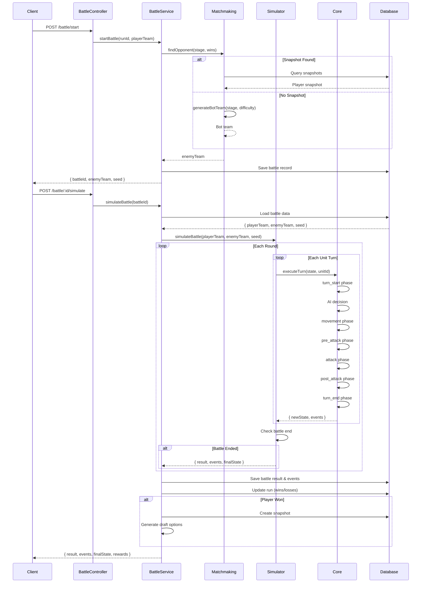

# Fantasy Roguelike Battle Simulator

[](https://github.com/Llayon/fantasy-roguelike/actions/workflows/ci.yml)
[](https://www.typescriptlang.org/)
[](https://nestjs.com/)
[](LICENSE)

A clean, modular battle simulator for roguelike autobattler games with deterministic combat, advanced mechanics, and async PvP.

## Overview

This repository contains a refactored battle simulator designed for roguelike game modes. It combines Core 1.0 (basic combat) with Core 2.0 (advanced mechanics) into a unified, maintainable codebase.

### Key Features

- **Unified Core Library**: Single source of truth for all battle mechanics (Core 1.0 + Core 2.0)
- **Compact Simulator**: Main simulation loop under 500 lines with clear phase flow
- **Deterministic Combat**: Same inputs + seed = identical results (enables replay)
- **14 Advanced Mechanics**: Facing, flanking, riposte, charge, resolve, phalanx, and more
- **Property-Based Testing**: 12 correctness properties verified with 100+ test iterations each
- **Async PvP**: Snapshot-based matchmaking with bot fallback
- **Clean API**: RESTful endpoints designed specifically for roguelike flow

### What's Different from Legacy Code

This is a **complete rewrite** of the battle simulator, not an incremental update:

- ❌ **Removed**: 2400+ line monolithic simulator with conversion layers
- ❌ **Removed**: MVP mode, real-time PvP queue, legacy team builder
- ✅ **Added**: Modular phase handlers with clear separation of concerns
- ✅ **Added**: Immutable state updates with full event history
- ✅ **Added**: Comprehensive property-based testing framework
- ✅ **Added**: Structured logging with battle context

## Architecture

### High-Level Overview

```
┌─────────────────────────────────────────────────────────────────┐
│                         Client (Frontend)                       │
│                    (Not in this repository)                     │
└────────────────────────────┬────────────────────────────────────┘
                             │ HTTP/REST
                             ▼
┌─────────────────────────────────────────────────────────────────┐
│                        API Layer (NestJS)                       │
│  ┌──────────┬──────────┬──────────┬──────────┬──────────────┐  │
│  │   Run    │  Battle  │  Draft   │ Upgrade  │ Matchmaking  │  │
│  │Controller│Controller│Controller│Controller│   Service    │  │
│  └──────────┴──────────┴──────────┴──────────┴──────────────┘  │
└────────────────────────────┬────────────────────────────────────┘
                             │
                             ▼
┌─────────────────────────────────────────────────────────────────┐
│                      Simulator (Pure Functions)                 │
│  ┌──────────────────────────────────────────────────────────┐  │
│  │  simulateBattle(playerTeam, enemyTeam, seed) → result    │  │
│  │                                                           │  │
│  │  Phase Flow:                                             │  │
│  │  turn_start → movement → pre_attack → attack →           │  │
│  │  post_attack → turn_end                                  │  │
│  └──────────────────────────────────────────────────────────┘  │
└────────────────────────────┬────────────────────────────────────┘
                             │
                             ▼
┌─────────────────────────────────────────────────────────────────┐
│                    Core Library (Game-Agnostic)                 │
│  ┌──────────┬──────────┬──────────┬──────────┬──────────────┐  │
│  │   Grid   │  Battle  │Mechanics │   Types  │    Utils     │  │
│  │  (A*)    │ (Damage) │(14 Tiers)│(BattleState)│ (Seeded RNG)│  │
│  └──────────┴──────────┴──────────┴──────────┴──────────────┘  │
└─────────────────────────────────────────────────────────────────┘
                             │
                             ▼
┌─────────────────────────────────────────────────────────────────┐
│                   Game Content (Game-Specific)                  │
│  ┌──────────┬──────────┬──────────┬──────────────────────────┐ │
│  │  Units   │Abilities │ Factions │      Bot Generator       │ │
│  └──────────┴──────────┴──────────┴──────────────────────────┘ │
└─────────────────────────────────────────────────────────────────┘
                             │
                             ▼
┌─────────────────────────────────────────────────────────────────┐
│                    Database (PostgreSQL)                        │
│  ┌──────────┬──────────┬──────────┬──────────┬──────────────┐  │
│  │   Runs   │ Battles  │Snapshots │ Bot Teams│   Run Deck   │  │
│  └──────────┴──────────┴──────────┴──────────┴──────────────┘  │
└─────────────────────────────────────────────────────────────────┘
```

### Detailed Architecture Diagram

```mermaid
graph TB
    subgraph Client["Client (Frontend - Not in this repo)"]
        UI[User Interface]
    end

    subgraph API["API Layer (NestJS)"]
        RC[Run Controller]
        BC[Battle Controller]
        DC[Draft Controller]
        UC[Upgrade Controller]
        
        RS[Run Service]
        BS[Battle Service]
        DS[Draft Service]
        US[Upgrade Service]
        MS[Matchmaking Service]
    end

    subgraph Simulator["Battle Simulator (Pure Functions)"]
        SIM[simulateBattle]
        TURN[executeTurn]
        
        subgraph Phases["Phase Handlers"]
            TS[turn_start]
            MOV[movement]
            PA[pre_attack]
            ATK[attack]
            POST[post_attack]
            TE[turn_end]
        end
        
        AI[AI Decision]
        DEATH[Death Handler]
    end

    subgraph Core["Core Library (Game-Agnostic)"]
        subgraph Grid["Grid System"]
            GRID[Grid Utils]
            PATH[A* Pathfinding]
        end
        
        subgraph Battle["Battle Calculations"]
            DMG[Damage Calculator]
            TURN_ORD[Turn Order]
            TARGET[Targeting]
        end
        
        subgraph Mechanics["14 Mechanics (Core 2.0)"]
            T0[Tier 0: Facing]
            T1[Tier 1: Resolve, Engagement, Flanking]
            T2[Tier 2: Riposte, Intercept, Aura]
            T3[Tier 3: Charge, Overwatch, Phalanx, LoS, Ammo]
            T4[Tier 4: Contagion, Armor Shred]
        end
        
        TYPES[Types: BattleState, BattleUnit]
        UTILS[Utils: Seeded RNG]
    end

    subgraph Game["Game Content (Game-Specific)"]
        UNITS[Unit Definitions]
        ABILITIES[Ability Data]
        FACTIONS[Faction Definitions]
        BOT_GEN[Bot Generator]
    end

    subgraph Roguelike["Roguelike Systems"]
        RUN[Run Progression]
        DRAFT[Draft System]
        UPGRADE[Upgrade System]
        SNAPSHOT[Snapshot System]
    end

    subgraph Database["Database (PostgreSQL)"]
        RUNS_TBL[(Runs Table)]
        DECK_TBL[(Run Deck Table)]
        BATTLES_TBL[(Battles Table)]
        SNAP_TBL[(Snapshots Table)]
        BOTS_TBL[(Bot Teams Table)]
    end

    subgraph Repos["Repositories (TypeORM)"]
        RUN_REPO[Run Repository]
        BATTLE_REPO[Battle Repository]
        SNAP_REPO[Snapshot Repository]
    end

    %% Client to API
    UI -->|HTTP/REST| RC
    UI -->|HTTP/REST| BC
    UI -->|HTTP/REST| DC
    UI -->|HTTP/REST| UC

    %% Controllers to Services
    RC --> RS
    BC --> BS
    DC --> DS
    UC --> US
    
    %% Services to Simulator
    BS --> SIM
    MS --> SIM
    
    %% Services to Roguelike Systems
    RS --> RUN
    DS --> DRAFT
    US --> UPGRADE
    MS --> SNAPSHOT
    MS --> BOT_GEN
    
    %% Simulator to Phases
    SIM --> TURN
    TURN --> TS
    TURN --> AI
    TURN --> MOV
    TURN --> PA
    TURN --> ATK
    TURN --> POST
    TURN --> TE
    TURN --> DEATH
    
    %% Phases to Core
    TS --> Mechanics
    MOV --> Grid
    MOV --> Mechanics
    PA --> Mechanics
    ATK --> Battle
    ATK --> Mechanics
    POST --> Mechanics
    TE --> Mechanics
    
    AI --> TARGET
    DEATH --> Battle
    
    %% Core dependencies
    Battle --> TYPES
    Mechanics --> TYPES
    Grid --> TYPES
    SIM --> UTILS
    
    %% Game Content
    SIM --> UNITS
    SIM --> ABILITIES
    BOT_GEN --> UNITS
    BOT_GEN --> FACTIONS
    
    %% Services to Repositories
    RS --> RUN_REPO
    BS --> BATTLE_REPO
    MS --> SNAP_REPO
    
    %% Repositories to Database
    RUN_REPO --> RUNS_TBL
    RUN_REPO --> DECK_TBL
    BATTLE_REPO --> BATTLES_TBL
    SNAP_REPO --> SNAP_TBL
    SNAP_REPO --> BOTS_TBL

    %% Styling
    classDef apiClass fill:#e1f5ff,stroke:#01579b,stroke-width:2px
    classDef simClass fill:#fff3e0,stroke:#e65100,stroke-width:2px
    classDef coreClass fill:#f3e5f5,stroke:#4a148c,stroke-width:2px
    classDef gameClass fill:#e8f5e9,stroke:#1b5e20,stroke-width:2px
    classDef dbClass fill:#fce4ec,stroke:#880e4f,stroke-width:2px
    
    class RC,BC,DC,UC,RS,BS,DS,US,MS apiClass
    class SIM,TURN,TS,MOV,PA,ATK,POST,TE,AI,DEATH simClass
    class GRID,PATH,DMG,TURN_ORD,TARGET,T0,T1,T2,T3,T4,TYPES,UTILS coreClass
    class UNITS,ABILITIES,FACTIONS,BOT_GEN,RUN,DRAFT,UPGRADE,SNAPSHOT gameClass
    class RUNS_TBL,DECK_TBL,BATTLES_TBL,SNAP_TBL,BOTS_TBL,RUN_REPO,BATTLE_REPO,SNAP_REPO dbClass
```



### Data Flow: Battle Simulation



### Component Responsibilities

| Component | Responsibility | Pure Function? |
|-----------|---------------|----------------|
| **Controllers** | HTTP request/response handling | No |
| **Services** | Business logic, orchestration | No |
| **Simulator** | Battle execution, deterministic | ✅ Yes |
| **Phase Handlers** | Individual phase logic | ✅ Yes |
| **Core Library** | Reusable game-agnostic utilities | ✅ Yes |
| **Mechanics** | Modular combat mechanics | ✅ Yes |
| **Repositories** | Database access layer | No |
| **Entities** | Database schema definitions | No |

### Project Structure

```
fantasy-roguelike/
├── src/
│   ├── core/                    # Unified Core Library (Game-Agnostic)
│   │   ├── types/               # BattleState, BattleUnit, BattleEvent
│   │   ├── grid/                # Grid utilities, A* pathfinding
│   │   │   ├── grid.ts          # createEmptyGrid, isValidPosition
│   │   │   └── pathfinding.ts   # findPath, hasPath
│   │   ├── battle/              # Combat calculations
│   │   │   ├── damage.ts        # calculatePhysicalDamage, rollDodge
│   │   │   ├── turn-order.ts    # buildTurnQueue, getNextUnit
│   │   │   └── targeting.ts     # selectTarget, findNearestEnemy
│   │   ├── mechanics/           # Core 2.0 - 14 Modular Mechanics
│   │   │   ├── config/          # Types, defaults, presets
│   │   │   ├── tier0/           # Facing (directional combat)
│   │   │   ├── tier1/           # Resolve, Engagement, Flanking
│   │   │   ├── tier2/           # Riposte, Intercept, Aura
│   │   │   ├── tier3/           # Charge, Overwatch, Phalanx, LoS, Ammo
│   │   │   ├── tier4/           # Contagion, Armor Shred
│   │   │   └── processor.ts     # MechanicsProcessor factory
│   │   └── utils/               # Seeded random, state helpers
│   │
│   ├── simulator/               # Battle Simulator (<500 lines)
│   │   ├── simulator.ts         # Main simulation loop
│   │   ├── turn.ts              # Turn execution
│   │   ├── death.ts             # Death handling
│   │   ├── phases/              # Phase handlers
│   │   │   ├── turn-start.ts    # Resolve regen, riposte reset
│   │   │   ├── movement.ts      # Pathfinding, intercept, charge
│   │   │   ├── attack.ts        # Facing, flanking, damage, riposte
│   │   │   └── turn-end.ts      # Contagion, shred decay, cooldowns
│   │   └── ai/                  # AI decision making
│   │       └── decision.ts      # Role-based target selection
│   │
│   ├── roguelike/               # Roguelike Game Logic
│   │   ├── run/                 # Run progression (wins/losses)
│   │   ├── draft/               # Card drafting (pick/reroll)
│   │   ├── upgrade/             # Unit tier upgrades (T1→T2→T3)
│   │   ├── snapshot/            # Async PvP matchmaking
│   │   ├── matchmaking/         # Opponent finding (snapshot or bot)
│   │   └── bot/                 # Bot team generation
│   │
│   ├── game/                    # Game-Specific Content
│   │   ├── units/               # Unit definitions (stats, abilities)
│   │   ├── abilities/           # Ability data (effects, cooldowns)
│   │   ├── factions/            # Faction definitions
│   │   └── constants/           # Game constants (budget, limits)
│   │
│   ├── api/                     # REST API (NestJS)
│   │   ├── run/                 # Run endpoints (start, get, abandon)
│   │   ├── battle/              # Battle endpoints (start, simulate, replay)
│   │   ├── draft/               # Draft endpoints (options, pick, reroll)
│   │   └── upgrade/             # Upgrade endpoints (available, upgrade)
│   │
│   ├── entities/                # TypeORM Database Entities
│   │   ├── run.entity.ts        # Run progression state
│   │   ├── run-deck.entity.ts   # Units in current run
│   │   ├── battle.entity.ts     # Battle results and events
│   │   ├── snapshot.entity.ts   # Player team snapshots for PvP
│   │   └── bot-team.entity.ts   # Pre-generated bot teams
│   │
│   ├── repositories/            # Database Repositories
│   │   ├── run.repository.ts
│   │   ├── battle.repository.ts
│   │   └── snapshot.repository.ts
│   │
│   ├── migrations/              # Database Migrations
│   │   ├── 1704067200000-CreateRunsTable.ts
│   │   ├── 1704067201000-CreateRunDeckTable.ts
│   │   └── ...
│   │
│   └── __tests__/               # Test Infrastructure
│       ├── fixtures/            # Test data (units, teams, states)
│       └── generators/          # Property test generators (fast-check)
│
├── docs/                        # Documentation
│   ├── API.md                   # Full API documentation
│   ├── API_DOCUMENTATION_SUMMARY.md
│   └── ERROR_CODES.md           # Error code reference
│
├── scripts/                     # Utility Scripts
│   └── seed-bot-teams.ts        # Seed bot teams for all stages
│
├── test/                        # E2E Tests
│   └── app.e2e-spec.ts
│
├── jest.config.js               # Jest configuration
├── tsconfig.json                # TypeScript configuration
├── package.json                 # Dependencies and scripts
└── README.md                    # This file
```

## Getting Started

### Prerequisites

- **Node.js**: 18.x or higher
- **npm**: 9.x or higher
- **PostgreSQL**: 14.x or higher
- **Docker** (optional): For running PostgreSQL in a container

### Installation

1. **Clone the repository**

```bash
git clone https://github.com/your-org/fantasy-roguelike.git
cd fantasy-roguelike
```

2. **Install dependencies**

```bash
npm install
```

3. **Set up the database**

Create a PostgreSQL database:

```bash
createdb fantasy_roguelike
```

Or use Docker:

```bash
docker run --name fantasy-roguelike-db \
  -e POSTGRES_PASSWORD=postgres \
  -e POSTGRES_DB=fantasy_roguelike \
  -p 5432:5432 \
  -d postgres:14
```

4. **Configure environment variables**

Create a `.env` file in the root directory:

```env
# Database
DATABASE_HOST=localhost
DATABASE_PORT=5432
DATABASE_USER=postgres
DATABASE_PASSWORD=postgres
DATABASE_NAME=fantasy_roguelike

# Server
PORT=3000
NODE_ENV=development

# Logging
LOG_LEVEL=debug
```

5. **Run database migrations**

```bash
npm run migration:run
```

6. **Seed bot teams** (optional but recommended)

```bash
npm run seed:bots
```

This generates bot teams for stages 1-9 with varying difficulties.

### Running the Application

**Development mode** (with hot reload):

```bash
npm run start:dev
```

**Production mode**:

```bash
npm run build
npm run start:prod
```

The API will be available at `http://localhost:3000`.

### Running Tests

**All tests**:

```bash
npm test
```

**Unit tests only**:

```bash
npm run test:unit
```

**Property-based tests only**:

```bash
npm run test:property
```

**E2E tests**:

```bash
npm run test:e2e
```

**Test coverage**:

```bash
npm run test:cov
```

### Development Workflow

1. **Make changes** to source files in `src/`
2. **Run tests** to verify correctness: `npm test`
3. **Check types**: `npm run build` (TypeScript compilation)
4. **Run linter**: `npm run lint`
5. **Format code**: `npm run format`

## API Documentation

### Base URL

```
http://localhost:3000/api
```

### Authentication

Currently, no authentication is required. This will be added in a future version.

### Endpoints Overview

| Endpoint | Method | Description |
|----------|--------|-------------|
| `/run/start` | POST | Start a new roguelike run |
| `/run/:runId` | GET | Get run details |
| `/run/:runId/abandon` | POST | Abandon current run |
| `/battle/start` | POST | Start a new battle |
| `/battle/:battleId/simulate` | POST | Simulate battle and get results |
| `/battle/:battleId/replay` | GET | Get battle replay data |
| `/draft/:runId/options` | GET | Get draft card options |
| `/draft/:runId/pick` | POST | Pick a draft card |
| `/draft/:runId/reroll` | POST | Reroll draft options |
| `/upgrade/:runId/available` | GET | Get available upgrades |
| `/upgrade/:runId/upgrade` | POST | Upgrade a unit |

### Example: Start a Run

**Request:**

```http
POST /api/run/start
Content-Type: application/json

{
  "factionId": "human",
  "leaderId": "knight_commander"
}
```

**Response:**

```json
{
  "runId": "run_abc123",
  "initialDeck": [
    { "unitId": "knight", "tier": 1, "cost": 5 },
    { "unitId": "archer", "tier": 1, "cost": 4 },
    { "unitId": "mage", "tier": 1, "cost": 6 }
  ],
  "budget": 10,
  "stage": 1,
  "wins": 0,
  "losses": 0
}
```

### Example: Simulate a Battle

**Request:**

```http
POST /api/battle/:battleId/simulate
Content-Type: application/json

{}
```

**Response:**

```json
{
  "result": "win",
  "events": [
    {
      "type": "move",
      "round": 1,
      "turn": 1,
      "actorId": "player_knight_0",
      "fromPosition": { "x": 3, "y": 0 },
      "toPosition": { "x": 3, "y": 2 }
    },
    {
      "type": "attack",
      "round": 1,
      "turn": 2,
      "actorId": "player_knight_0",
      "targetId": "enemy_rogue_0",
      "damage": 15,
      "damageType": "physical"
    },
    {
      "type": "riposte_triggered",
      "round": 1,
      "turn": 2,
      "defenderId": "enemy_rogue_0",
      "attackerId": "player_knight_0",
      "damage": 8,
      "chance": 0.34
    }
  ],
  "finalState": {
    "playerUnits": [
      {
        "instanceId": "player_knight_0",
        "currentHp": 92,
        "maxHp": 100,
        "alive": true
      }
    ],
    "enemyUnits": [
      {
        "instanceId": "enemy_rogue_0",
        "currentHp": 0,
        "maxHp": 50,
        "alive": false
      }
    ]
  },
  "rewards": {
    "gold": 50,
    "draftOptions": [
      { "unitId": "priest", "tier": 1, "cost": 4 },
      { "unitId": "berserker", "tier": 1, "cost": 5 },
      { "unitId": "hunter", "tier": 1, "cost": 4 }
    ]
  }
}
```

For complete API documentation with all endpoints, request/response schemas, and error codes, see:
- **[docs/API.md](docs/API.md)** - Full API reference
- **[docs/ERROR_CODES.md](docs/ERROR_CODES.md)** - Error code reference

## Core Mechanics

### Battle Phase Flow

Each unit's turn follows this strict phase order:

1. **turn_start**: Resolve regeneration, riposte charge reset, routing check
2. **ai_decision**: AI selects action (attack/move/ability)
3. **movement**: Pathfinding, intercept checks, engagement updates, charge momentum
4. **pre_attack**: Facing rotation, flanking calculation, ammo check
5. **attack**: Damage calculation, dodge roll, riposte trigger
6. **post_attack**: Armor shred application, ammo consumption
7. **turn_end**: Contagion spread, shred decay, cooldown ticks

### 14 Advanced Mechanics (Core 2.0)

| Tier | Mechanic | Description |
|------|----------|-------------|
| 0 | **Facing** | Units face N/S/E/W, affects flanking |
| 1 | **Resolve** | Morale system, routing at 0 resolve |
| 1 | **Engagement** | Zone of control, attack of opportunity |
| 1 | **Flanking** | +15% damage from flank, +30% from rear |
| 2 | **Riposte** | 30% chance to counter-attack from front |
| 2 | **Intercept** | Spearmen stop cavalry charges |
| 2 | **Aura** | Passive effects to nearby allies |
| 3 | **Charge** | +10% damage per cell moved (max 5) |
| 3 | **Overwatch** | Skip turn to attack moving enemies |
| 3 | **Phalanx** | +2 armor per adjacent ally |
| 3 | **Line of Sight** | Ranged attacks blocked by units |
| 3 | **Ammunition** | Ranged units have limited ammo |
| 4 | **Contagion** | Status effects spread to adjacent units |
| 4 | **Armor Shred** | Armor degrades with each hit, decays over time |

### Deterministic Combat

All randomness uses a seeded PRNG (Pseudo-Random Number Generator):

```typescript
const result = simulateBattle(playerTeam, enemyTeam, seed);
// Same inputs + seed = identical output every time
```

This enables:
- **Battle replay**: Reconstruct exact battle from events
- **Testing**: Reproducible test cases
- **Debugging**: Consistent behavior for bug reports

### AI Decision Making

AI follows role-based priorities:

- **Tank**: Taunt → Defensive buff → Attack → Move
- **Melee DPS**: Execute low HP → Damage ability → Attack weakest
- **Ranged DPS**: AoE if 2+ enemies → Single target → Attack
- **Support**: Heal wounded → Buff allies → Attack
- **Control**: Stun high threat → Attack

Ties are broken by unit `instanceId` for determinism.

## Testing

### Test Coverage

- **650+ unit tests**: Individual functions and components
- **12 property-based tests**: Universal correctness properties
- **100+ iterations per property**: Verified across random inputs
- **Integration tests**: Full API flow (run → battle → draft → upgrade)

### Property-Based Testing

We use [fast-check](https://github.com/dubzzz/fast-check) to verify correctness properties:

```typescript
// Example: Property 2 - Dead units never act
fc.assert(
  fc.property(battleStateArb, fc.integer(), (initialState, seed) => {
    const result = simulateBattle(playerTeam, enemyTeam, seed);
    
    const deadUnitIds = new Set(
      result.events
        .filter(e => e.type === 'unit_died')
        .map(e => e.targetId)
    );
    
    const actionsAfterDeath = result.events.filter(e => 
      e.actorId && deadUnitIds.has(e.actorId) &&
      ['attack', 'move', 'ability'].includes(e.type)
    );
    
    return actionsAfterDeath.length === 0;
  }),
  { numRuns: 100 }
);
```

### Running Specific Tests

```bash
# Run tests for a specific file
npm test -- simulator.spec.ts

# Run tests matching a pattern
npm test -- --testNamePattern="Property 2"

# Run tests in watch mode
npm test -- --watch

# Run with coverage
npm test -- --coverage
```

## Tech Stack

| Layer | Technology | Version |
|-------|------------|---------|
| Runtime | Node.js | 18+ |
| Framework | NestJS | 10.x |
| Language | TypeScript | 5.x |
| Database | PostgreSQL | 14+ |
| ORM | TypeORM | 0.3.x |
| Testing | Jest | 29.x |
| Property Testing | fast-check | 3.x |
| Validation | class-validator | 0.14.x |
| Documentation | Swagger/OpenAPI | 3.0 |

## Development Standards

### Code Style

- **TypeScript**: Explicit types, no `any`, no non-null assertions
- **JSDoc**: All public functions must have `@param`, `@returns`, `@example`
- **Logging**: Use NestJS Logger with context (battleId, unitId, phase)
- **Immutability**: State updates create new objects, never mutate

### Example Function Documentation

```typescript
/**
 * Calculates physical damage with armor reduction.
 * Formula: max(1, (ATK - armor) * atkCount)
 * 
 * @param attacker - Unit dealing damage
 * @param target - Unit receiving damage
 * @returns Damage value (minimum 1)
 * 
 * @example
 * const damage = calculatePhysicalDamage(
 *   { stats: { atk: 15, atkCount: 2 } },
 *   { stats: { armor: 10 } }
 * );
 * // Returns: 10 = max(1, (15 - 10) * 2)
 */
function calculatePhysicalDamage(
  attacker: BattleUnit,
  target: BattleUnit
): number {
  const rawDamage = (attacker.stats.atk - target.stats.armor) * attacker.stats.atkCount;
  return Math.max(1, rawDamage);
}
```

### Logging Example

```typescript
this.logger.debug('Riposte triggered', {
  battleId: 'battle_123',
  round: 3,
  turn: 7,
  phase: 'attack',
  defenderId: 'player_knight_0',
  attackerId: 'enemy_rogue_1',
  damage: 15,
  chance: 0.45
});
```

## Contributing

### Workflow

1. **Fork** the repository
2. **Create** a feature branch: `git checkout -b feature/my-feature`
3. **Make** your changes
4. **Add tests** for new functionality
5. **Run tests**: `npm test`
6. **Commit** with descriptive message: `git commit -m "Add riposte mechanic"`
7. **Push** to your fork: `git push origin feature/my-feature`
8. **Create** a Pull Request

### Commit Message Format

```
<type>(<scope>): <subject>

<body>

<footer>
```

**Types**: `feat`, `fix`, `docs`, `style`, `refactor`, `test`, `chore`

**Example**:

```
feat(simulator): add charge momentum calculation

- Calculate momentum based on distance moved
- Apply +10% damage per momentum point
- Cap momentum at 5 (max +50% damage)

Closes #42
```

## Troubleshooting

### Database Connection Issues

**Problem**: `ECONNREFUSED` when connecting to PostgreSQL

**Solution**:
1. Verify PostgreSQL is running: `pg_isready`
2. Check connection settings in `.env`
3. Ensure database exists: `psql -l | grep fantasy_roguelike`

### Migration Errors

**Problem**: `QueryFailedError: relation "runs" already exists`

**Solution**:
```bash
# Revert all migrations
npm run migration:revert

# Run migrations again
npm run migration:run
```

### Test Failures

**Problem**: Property tests failing intermittently

**Solution**:
1. Check if test uses seeded random correctly
2. Verify generators produce valid inputs
3. Run with specific seed: `npm test -- --seed=12345`

### TypeScript Compilation Errors

**Problem**: `Cannot find module '@core/types'`

**Solution**:
1. Clean build artifacts: `rm -rf dist/`
2. Rebuild: `npm run build`
3. Check `tsconfig.json` paths are correct

## Performance

### Benchmarks

- **Battle simulation**: ~5ms for 100 rounds (typical battle: 20-30 rounds)
- **Matchmaking**: ~10ms to find snapshot or generate bot
- **API response time**: <50ms for most endpoints
- **Database queries**: <5ms with proper indexes

### Optimization Tips

1. **Use indexes**: All foreign keys and frequently queried fields are indexed
2. **Batch operations**: Use `Promise.all()` for parallel database queries
3. **Cache bot teams**: Pre-generated bots are stored in database
4. **Limit event history**: Only store last 100 battles per run

## Roadmap

### Version 1.0 (Current)

- ✅ Core 1.0 + Core 2.0 mechanics
- ✅ Roguelike run progression
- ✅ Async PvP with snapshots
- ✅ Property-based testing
- ✅ API documentation

### Version 1.1 (Planned)

- [ ] Authentication & authorization
- [ ] Leaderboards
- [ ] Replay sharing
- [ ] Unit balance adjustments
- [ ] Performance monitoring

### Version 2.0 (Future)

- [ ] Real-time PvP mode
- [ ] Tournament system
- [ ] Custom game modes
- [ ] Mod support
- [ ] Mobile app

## License

MIT License - see [LICENSE](LICENSE) file for details.

## Support

- **Documentation**: [docs/API.md](docs/API.md)
- **Issues**: [GitHub Issues](https://github.com/your-org/fantasy-roguelike/issues)
- **Discussions**: [GitHub Discussions](https://github.com/your-org/fantasy-roguelike/discussions)

## Acknowledgments

- Built with [NestJS](https://nestjs.com/)
- Property testing with [fast-check](https://github.com/dubzzz/fast-check)
- Inspired by autobattler games like Teamfight Tactics and Dota Auto Chess
